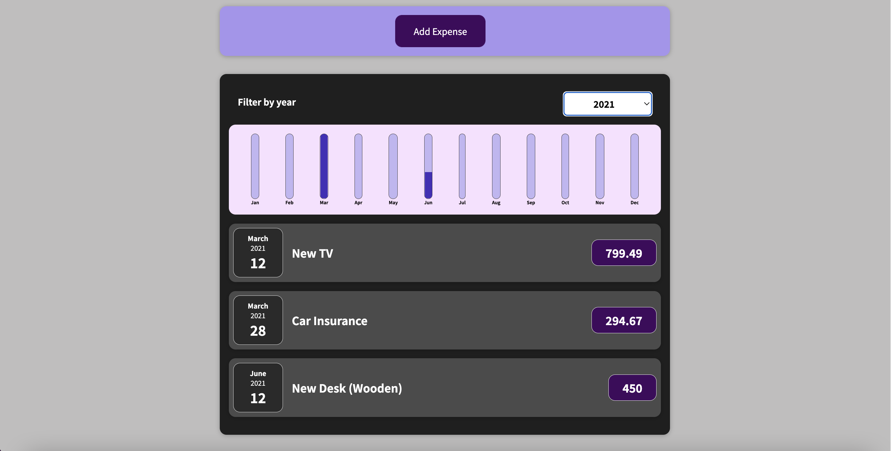

# React-Project
My very first React project

## Overview

This application allows you to add an expense item, including the name, amount, and date of purchase. The site will display a bar chart of all of your expenses throughout the year based upon the month of the purchased items.

## Skills

-React\
-Hooks\
-CSS\
-JavaScript Logic\
-HTML

## Screenshot

## Link

